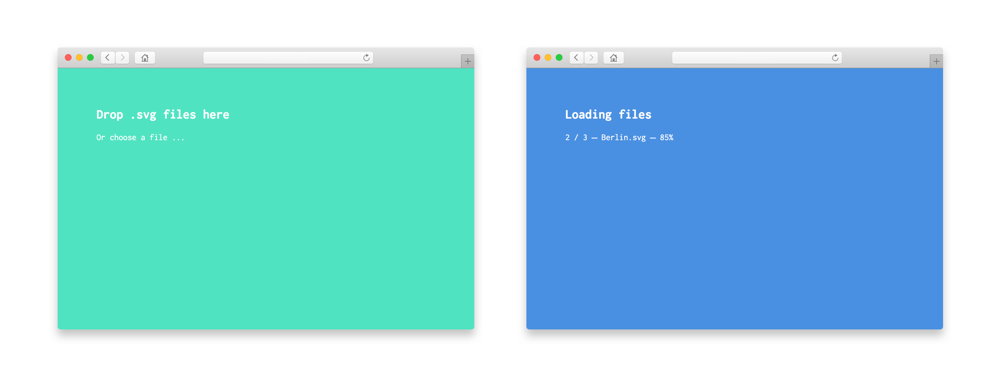

# SVGnest batch

## About
This script uses the svg nesting library [SVGnest](http://svgnest.com/) by the awesome Jack Qiao. You can drag and drop files to process multiple files after each other. Handy when you have to process multiple files (with the same settings).

**DISCLAIMER: This script was written for a very specific use case, so you might have to adapt things for your needs** 😞

## How to run
1. Download everything
2. Serve using a localhost (otherwise it will not work, because SVGnest is using a webworker)
3. Done.

**Note:** If you don't know how to set up a localhost, use an extension like [Web Server for Chrome](https://chrome.google.com/webstore/detail/web-server-for-chrome/ofhbbkphhbklhfoeikjpcbhemlocgigb?hl=en).

## How to use
Drag and drop an .svg file into the window (multiple also work). After being processed, they will be saved into your downloads folder.

**Limitation 1:** The .svg has to contain the bin (where other elements are packed into) and be tagged by a class named 'bin'.

**Limitation 2:** Settings are hardcoded into the *index.html* file. Change these to change settings.

**Limitation 3:** Supports only 1 iteration for now.

**Limitation 4:** The exported files will have numbers counting upwards (e.g. 001, 002, etc.), but every second file will have an *m* added to it (I mentioned it before—very specific use case ...).

## License
My code is public domain, but please check [https://github.com/Jack000/SVGnest](Jack000's repository) for details on SVGnest.